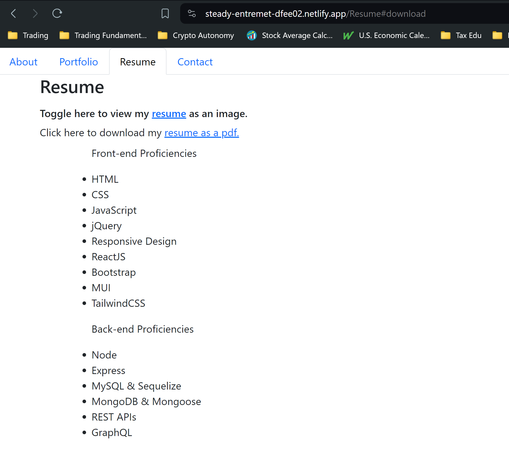

# Personal Portfolio using React

LINK TO DEPLOYED APPLICATION: https://steady-entremet-dfee02.netlify.app/

 

## Discription
The purpose of this project was to apply my understanding of React to build a personal porfolio application. This application also furthers my professional goals by being a space where I can showcase myself, and the web development projects that Ive created, through out my time as a web developer. It serves as a project that is relevant through all skill levels, and as such, will grow in uniqueness and purpose as my programming skills grow.

## Table of Contents

- [Installation](#installation-processes)
- [Usage](#app-usage)
- [License](#license)
- [Contributors](#contributors)

## Installation Processes
There are no steps to deploy this project. If you wish to view my portfolio project please visit this link: https://steady-entremet-dfee02.netlify.app/ . To view the work and technology used to create this project view my GitHub repo: https://github.com/TrevorsDev/React_Portfolio

## App Usage
My portfolio project was made to be easy and intuitive to navigate. By viewing the deployed link to my portfolio, I hope to convey that experience to the user.

To download my resume, please click the link in blue shown in this picture as "resume as a pdf": 

 

## License
this project is licensed under the mit.

## Contributors
All contributions apart from myself belong to the community of TAs, tutors, and teachers of ASUs Full Stack Web Development Program.

## Questions
If you have any questions about the repo, open an issue or contact me directly at undefined. If you want to see more of my work, please visit my [undefined](https://github.com/undefined)
